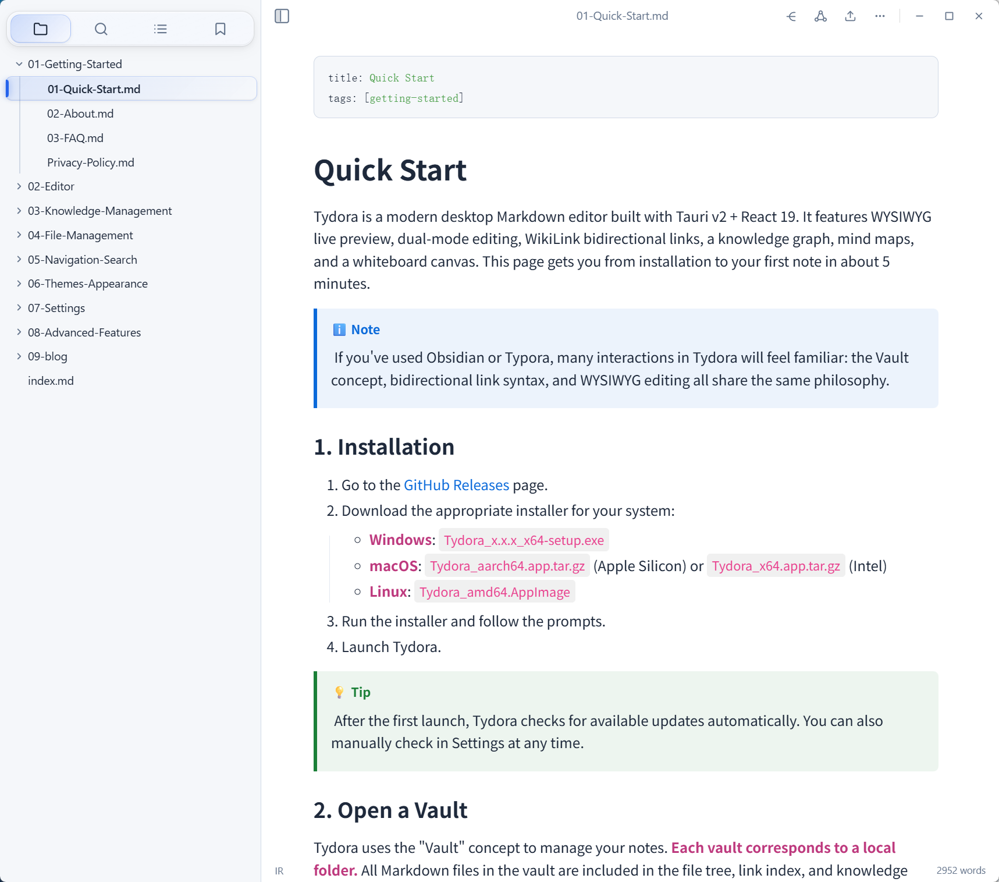
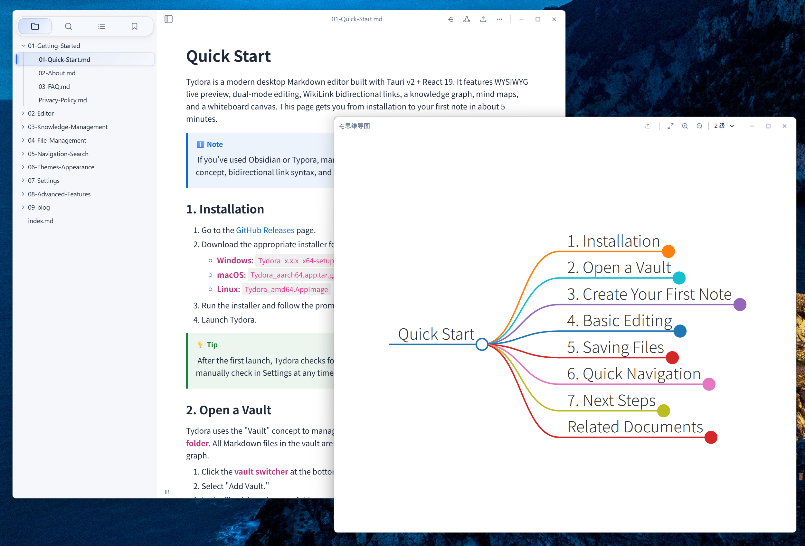
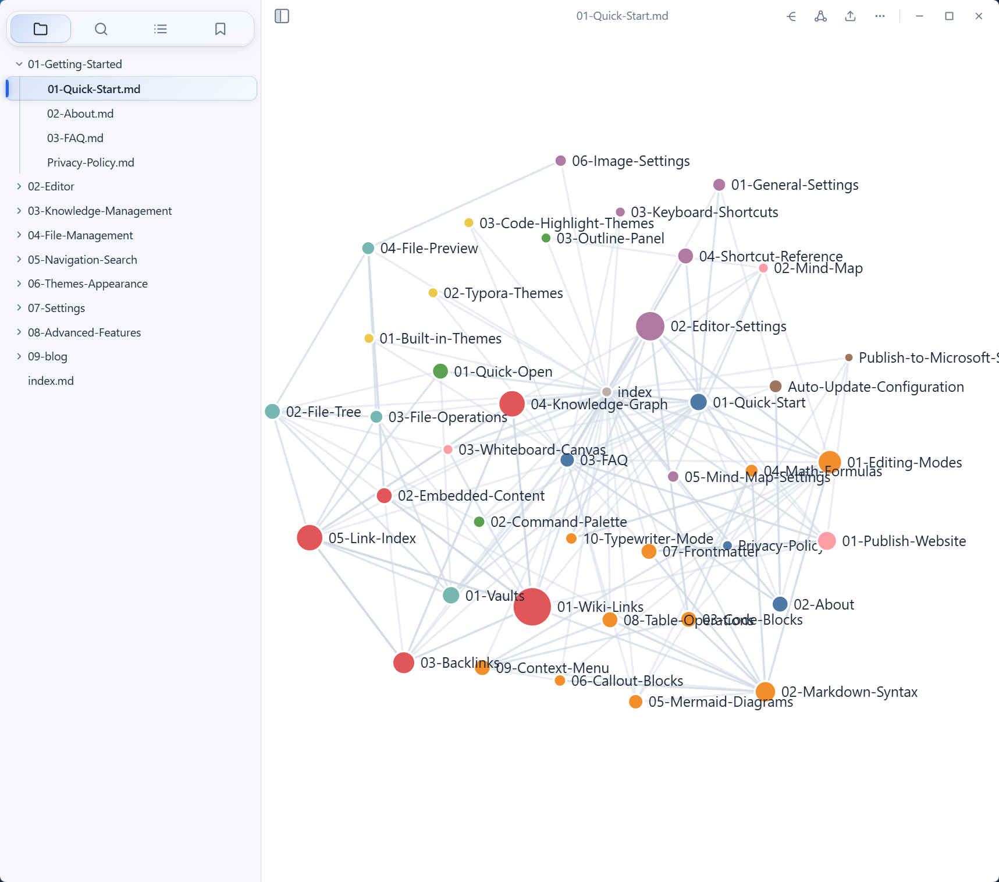
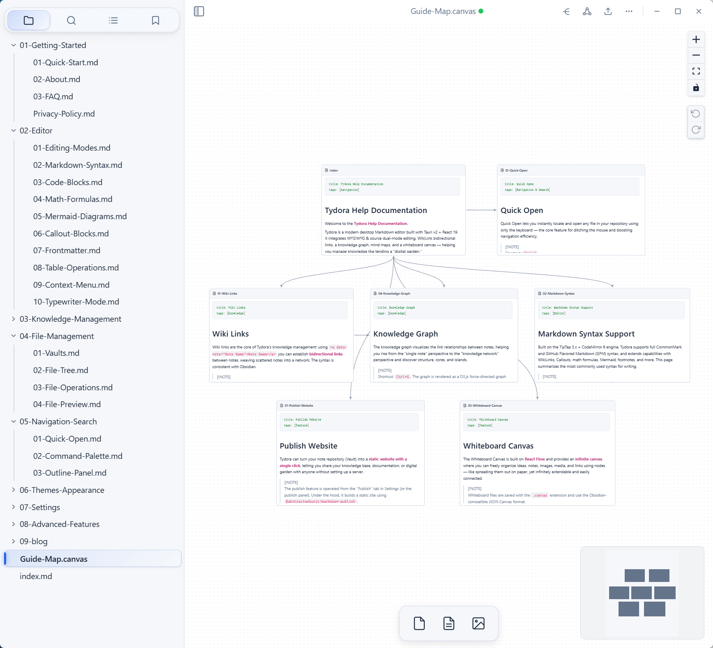

# Tydora

> A modern desktop Markdown editor

[](https://github.com/zuorn/Tydora)
[](https://github.com/zuorn/Tydora/releases)
[](LICENSE)
[]()
[](https://v2.tauri.app/)
[](https://react.dev/)

[中文](README_ZH.md) | English

<br />

<table>
  <tr>
    <td align="center" width="50%"></td>
    <td align="center" width="50%"></td>
  </tr>
  <tr>
    <td align="center" width="50%"></td>
    <td align="center" width="50%"></td>
  </tr>
</table>

## Core Features

- **Dual-Mode Editing** — Seamlessly switch between WYSIWYG (TipTap) and Source mode (CodeMirror 6)
- **WikiLink Bidirectional Links** — Obsidian-style `[[backlinks]]` with backlink panel and autocomplete
- **Knowledge Graph** — D3.js force-directed graph visualizing relationships between documents
- **Mind Map** — Auto-generated interactive mind map from Markdown heading hierarchy
- **Infinite Canvas** — Whiteboard canvas supporting text, notes, media, URL, and more node types
- **Rich Theming** — 8 built-in themes + custom CSS import + 11 code highlighting color schemes
- **One-Click Publish** — Publish your vault as a static website with a built-in preview server
- **Multi-Window Architecture** — Settings, graph, mind map, and canvas in independent windows with multi-monitor support

## Tech Stack

| Layer      | Technology                                                    |
| ---------- | ------------------------------------------------------------- |
| Frontend   | React 19 + TypeScript + Vite 6                                |
| Editor     | TipTap 3.x (WYSIWYG) + CodeMirror 6 (Source)                  |
| Backend    | Rust (Tauri v2)                                               |
| Visual     | D3.js (Graph) + markmap (Mind Map) + React Flow (Canvas)      |
| Plugins    | tauri-plugin-fs / dialog / window-state / updater / process   |

## Quick Start

### Prerequisites

- [Node.js](https://nodejs.org/) >= 18
- [Rust](https://www.rust-lang.org/tools/install) >= 1.75
- Tauri v2 system dependencies (see [Tauri Prerequisites](https://v2.tauri.app/start/prerequisites/))

### Install & Run

```bash
# Clone the repository
git clone https://github.com/zuorn/Tydora.git
cd Tydora

# Install dependencies
npm install

# Start development mode
npm run tauri
```

### Build

```bash
# Build for production
npm run tauri build
```

Build artifacts are located in `src-tauri/target/release/bundle/`.

## Project Structure

```
Tydora/
├── src/                        # Frontend source
│   ├── App.tsx                 # Main component & state management
│   ├── Editor/                 # Editor module
│   │   ├── TipTapEditor.tsx    # WYSIWYG editor
│   │   └── SourceEditor.tsx    # Source code editor
│   ├── wikilink/               # WikiLink bidirectional link system
│   ├── graph/                  # Knowledge graph
│   ├── mindmap/                # Mind map
│   ├── Canvas/                 # Infinite canvas
│   ├── components/             # Shared UI components
│   ├── publish/                # Publishing system
│   └── themes/                 # Theme system
├── src-tauri/                  # Rust backend
│   └── src/
│       ├── lib.rs              # Tauri commands & plugins
│       └── commands/           # Modular commands
├── docs/                       # Project documentation
└── website/                    # MkDocs documentation site
```

## Documentation

- [Technical Architecture](docs/technical-architecture.md) (Chinese)
- [Product Design](docs/product-design.md) (Chinese)

## Contributing

Issues and pull requests are welcome! Please read the project documentation to understand the architecture first.

## License

This project is licensed under the [Apache License 2.0](LICENSE).
