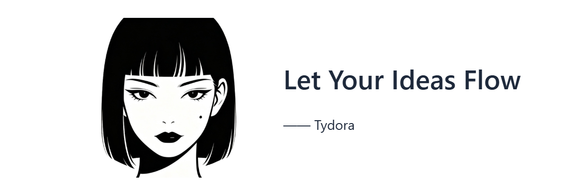

[](https://github.com/zuorn/Inimark)
[](https://github.com/zuorn/Inimark/releases)
[](LICENSE)
[]()
[](https://v2.tauri.app/)
[](https://react.dev/)
[](https://www.dsh.so/artifact/inimark)
[](https://www.dsh.so/artifact/inimark)

[中文](README_ZH.md) | English



---

**Inimark** — write without end, think without bounds.

Not a toolbox that tries to do everything — a quiet desk. Write well first; when you need to, let ideas find each other and patterns emerge.

🔗 [Website & docs](https://zuorn.github.io/Inimark/)

---

## Focus on editing

WYSIWYG and source, one keystroke apart. An interface pared to the words — the tool steps back; wherever the cursor lands, your thought lands on the page.


---

## Focus on thinking

Notes can link to each other. Unfold a graph or mind map when structure calls. Spread out on a canvas when lines aren't enough. Extensions for thinking — not another bloated system.


---

## Quick Start

1. Download and install Inimark from [Releases](https://github.com/zuorn/Inimark/releases)

## Run from Source

```bash
git clone https://github.com/zuorn/Inimark.git
cd Inimark
npm install

npm run tauri dev
npm run tauri build
```

## Tech Stack

| Layer         | Technology                                                  |
| ------------- | ----------------------------------------------------------- |
| Frontend      | React 19 + TypeScript + Vite 6                              |
| Editor        | TipTap 3.x (WYSIWYG) + CodeMirror 6 (Source)                |
| Backend       | Rust (Tauri v2)                                             |
| Visualization | D3.js (Graph) + markmap (Mind Map) + React Flow (Canvas)    |
| Plugins       | tauri-plugin-fs / dialog / window-state / updater / process |

## Contributing

Issues and pull requests are welcome!

## License

This project is licensed under the [Apache License 2.0](LICENSE).

## Star History

<a href="https://www.star-history.com/?repos=zuorn%2FInimark&type=date&legend=top-left">
 <picture>
   <source media="(prefers-color-scheme: dark)" srcset="https://api.star-history.com/chart?repos=zuorn/Inimark&type=date&theme=dark&legend=top-left&sealed_token=UbjlpYMAKlj9YxE9TrI3oZEpbMArNY0oRBtXdZ4GlQe9lQG0bgKmhoGnECO6aR-BCg34sIpFHJLyux4trfCJQVTOG2DIOa2HKERx9cCUMNhsoboxUFNz8g" />
   <source media="(prefers-color-scheme: light)" srcset="https://api.star-history.com/chart?repos=zuorn/Inimark&type=date&legend=top-left&sealed_token=UbjlpYMAKlj9YxE9TrI3oZEpbMArNY0oRBtXdZ4GlQe9lQG0bgKmhoGnECO6aR-BCg34sIpFHJLyux4trfCJQVTOG2DIOa2HKERx9cCUMNhsoboxUFNz8g" />
   
 </picture>
</a>
