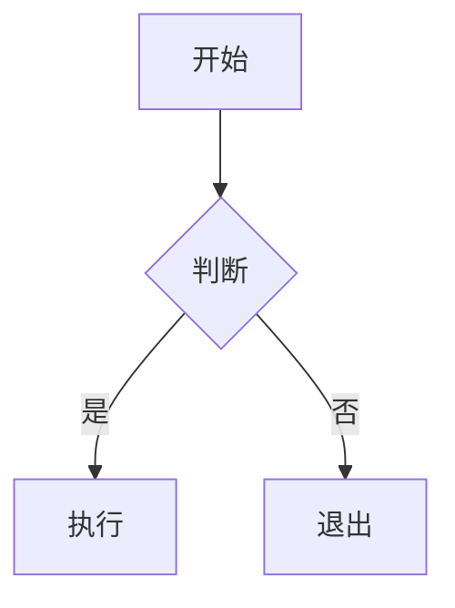
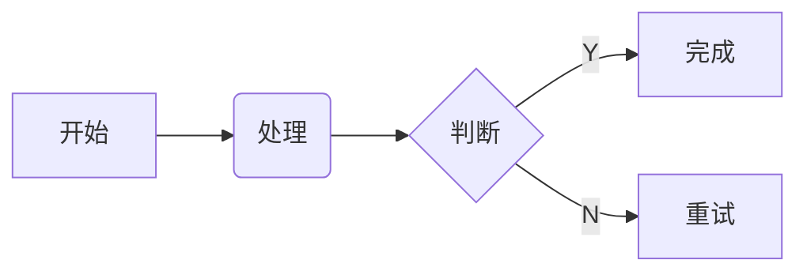
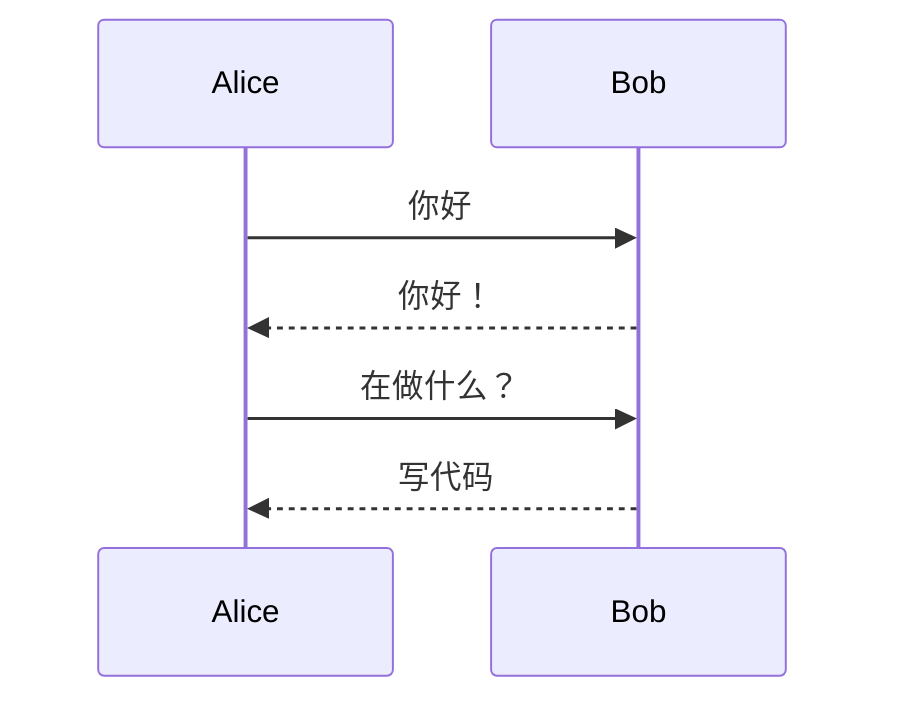
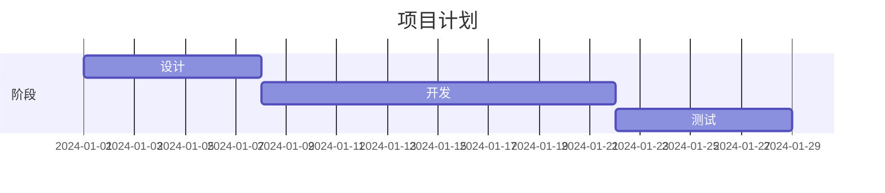
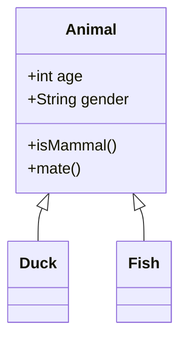
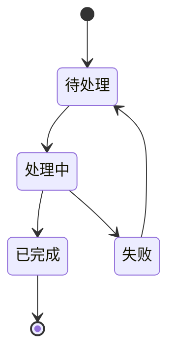

# Mermaid 图表

Tydora 集成了 Mermaid 图表引擎，支持在 Markdown 中直接绘制流程图、时序图、甘特图等多种图表。

## 基本语法

使用 `mermaid` 代码块编写图表：

````markdown

````

## 支持的图表类型

### 流程图（Flowchart）



````markdown

````

### 时��图（Sequence Diagram）

````markdown

````

### 甘特图（Gantt Chart）

````markdown

````

### 类图（Class Diagram）

````markdown

````

### 状态图（State Diagram）

````markdown

````

## 编辑器功能

在 Mermaid 代码块中，编辑器提供：

- **实时预览**：编写代码时自动渲染图表预览
- **内嵌编辑器**：Mermaid 代码块内部使用专用编辑器
- **语法高亮**：Mermaid 语法自动高亮

## 样式主题

Mermaid 图表的配色会跟随应用主题自动调整，确保在浅色和深色模式下都有良好的可读性。

## 相关文档

- [[Markdown语法]] — 完整语法支持
- [[代码块]] — 代码块功能
