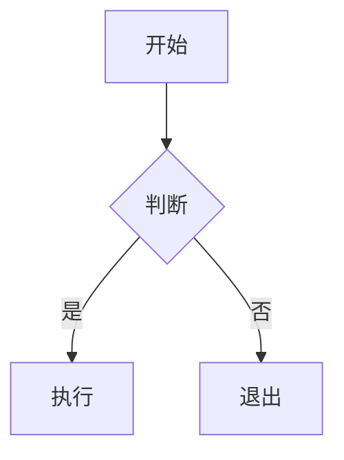
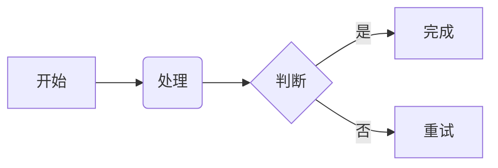
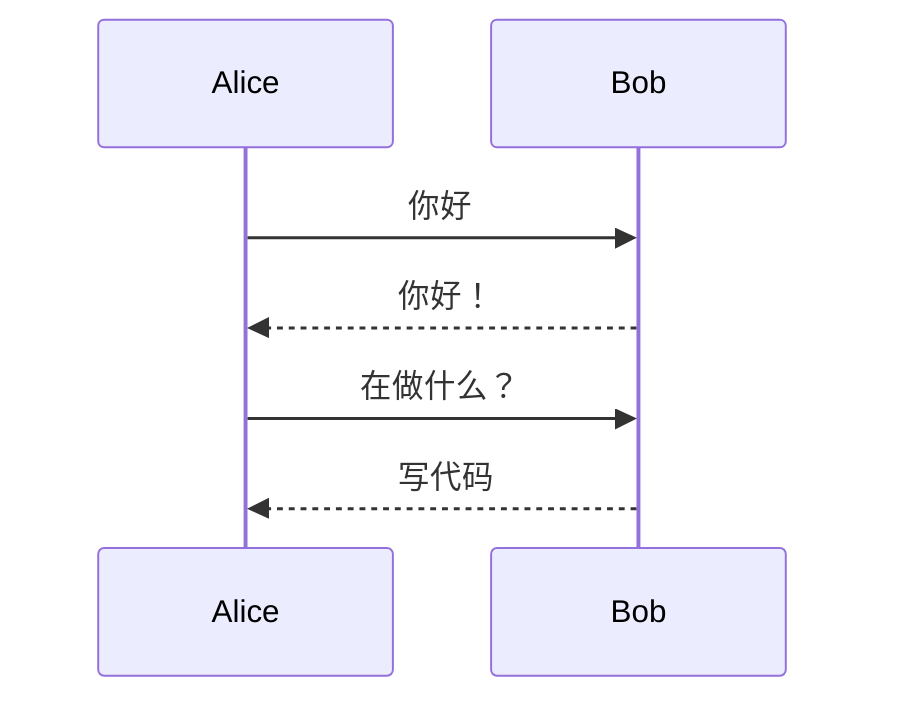
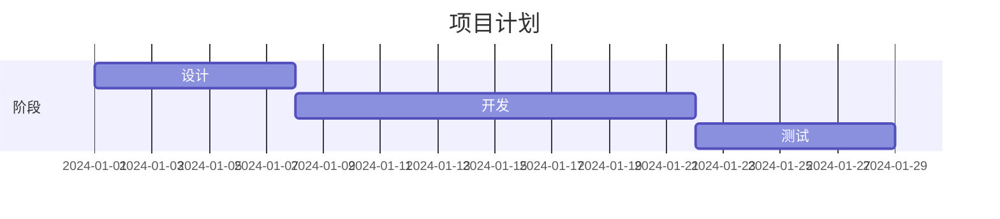
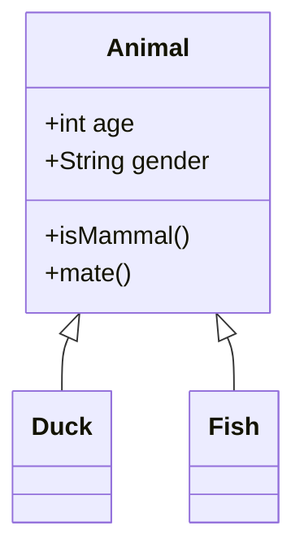
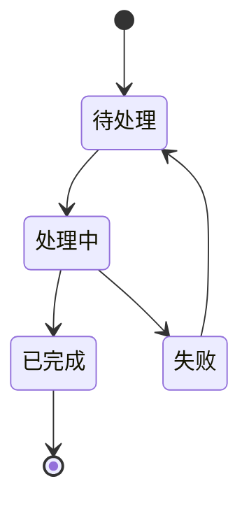
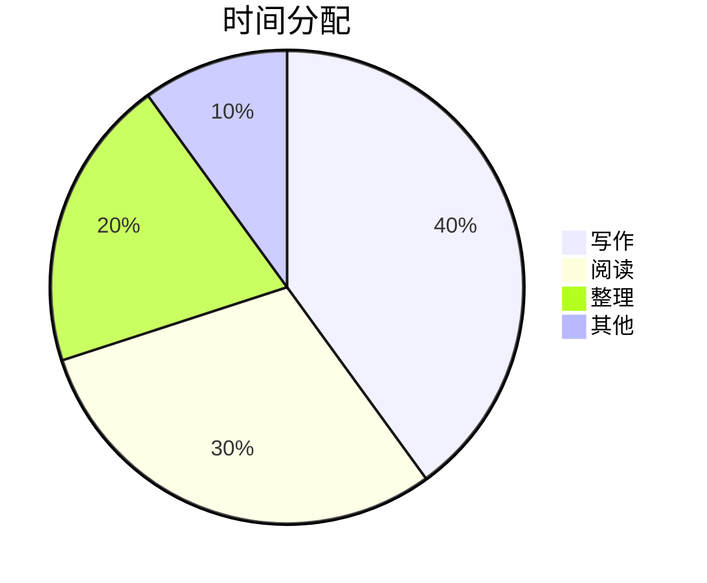

# Mermaid 图表

Tydora 集成了 Mermaid 图表引擎，让你直接在 Markdown 中用文本绘制流程图、时序图、甘特图、类图、状态图等，并实时渲染预览。

> [!NOTE]
> 使用 \`\`\`mermaid 代码块编写。图表渲染默认开启，可在 [[设置/编辑器设置]] 中关闭。

## 基本语法

用 `mermaid` 作为代码块语言：

````markdown

````

## 支持的图表类型

### 流程图（Flowchart）



````markdown

````

### 时序图（Sequence Diagram）

````markdown

````

### 甘特图（Gantt Chart）

````markdown

````

### 类图（Class Diagram）

````markdown

````

### 状态图（State Diagram）

````markdown

````

### 饼图（Pie Chart）

````markdown

````

## 编辑器功能

在 Mermaid 代码块中，Tydora 提供：

- **实时预览**：编写代码时自动渲染图表
- **内嵌编辑器**：代码块内使用专用编辑器编辑源码
- **语法高亮**：Mermaid 语法自动高亮，便于排查错误

## 样式主题

Mermaid 图表的配色会**跟随应用主题**自动调整（浅色 / 深色），确保在任意主题下都清晰可读。

> [!TIP]
> 若图表未渲染，多半是语法有误。先确认代码块语言标注为 `mermaid`，再检查括号、箭头符号是否配对。可参考 [Mermaid 官方文档](https://mermaid.js.org/) 核对语法。

## 相关文档

- [[Markdown语法]] — 完整语法支持
- [[代码块]] — 代码块功能
- [[设置/编辑器设置]] — 图表渲染开关
