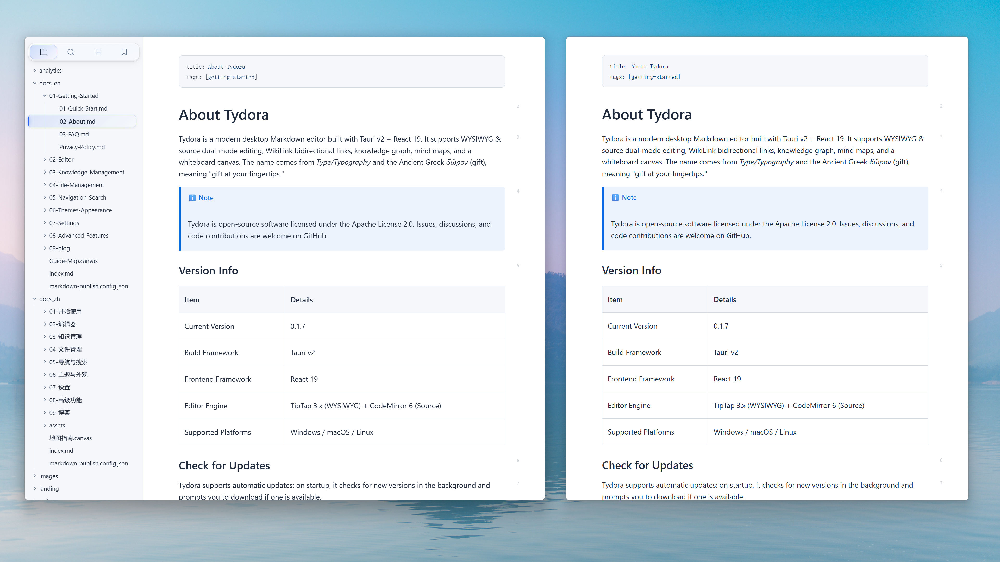
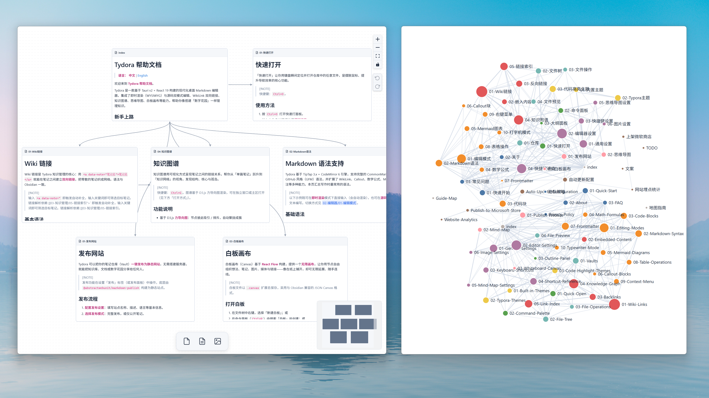
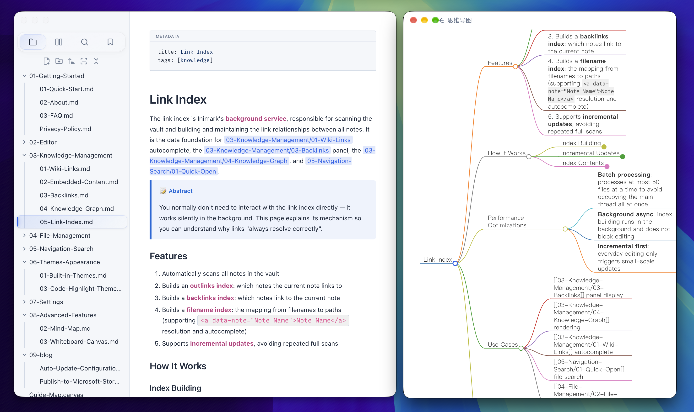

# 无限书写，思维无界

---

**Inimark** — 无限书写，思维无界。

它不试图成为什么都有的工具箱，只是一张安静的书桌——先把字写好，再在需要时，让想法彼此相连、脉络显现。

---

## **✒️ 专注编辑**

所见即所得，源码随切随用。界面干净到只剩文字。工具退到幕后，光标所至，思绪便落在纸上。

---

## **🧠 专注思维**

笔记可以彼此相连；需要整理时，展开图谱与导图；思绪铺不开时，还有无限白板。它们是思考的延伸，而不是另一套臃肿的系统。

---

## **🪑 一张书桌，静候同路人**

书写没有尽头，思维也不必画地为牢。如果你也在寻找这样一张**安静、专注**的书桌，不妨来 **Inimark** 坐坐。

🔗 [https://zuorn.github.io/Inimark](https://zuorn.github.io/Inimark)
